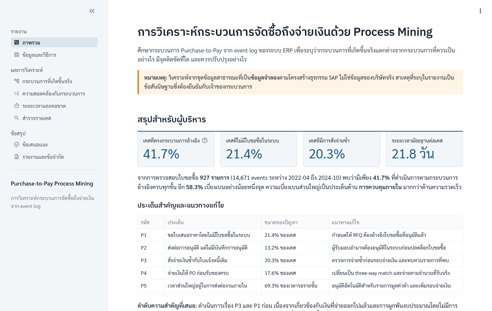
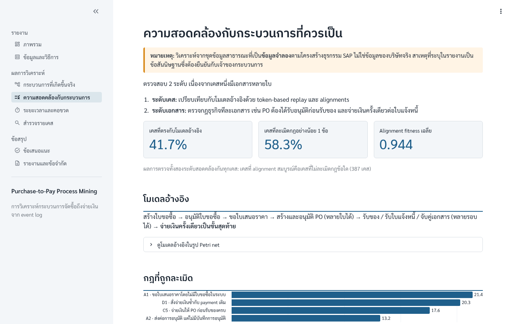
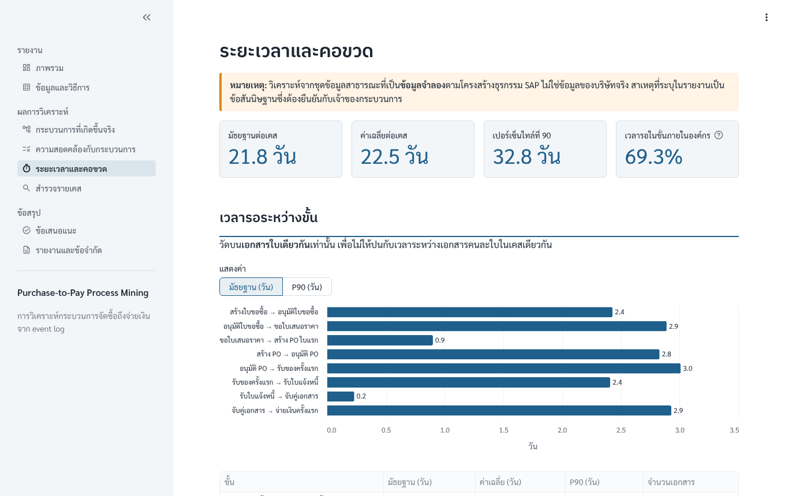
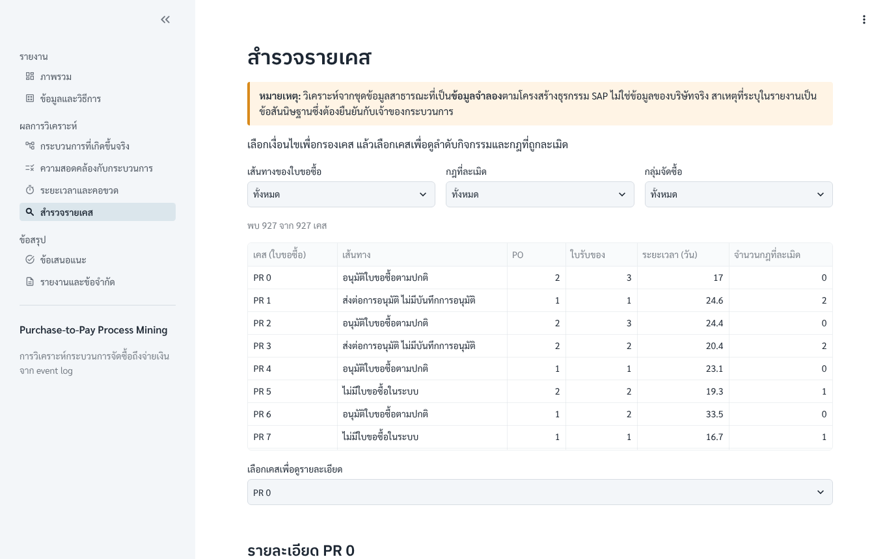
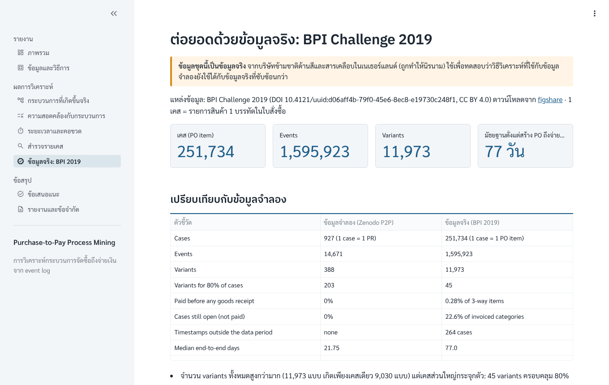

**Live demo:** https://purchase-to-pay-process-mining-cwxvungo6invrbnsb6jgta.streamlit.app/

# Purchase-to-Pay Process Mining

**ภาษาไทย** — วิเคราะห์กระบวนการจัดซื้อถึงจ่ายเงิน (Purchase-to-Pay) จาก event log ของระบบ ERP ด้วย Python และ PM4Py
เพื่อระบุว่ากระบวนการที่เกิดขึ้นจริงแตกต่างจากกระบวนการที่ควรเป็นอย่างไร มีจุดติดขัดที่ใด และควรปรับปรุงอย่างไร
ผลการศึกษานำเสนอเป็นเว็บแอป Streamlit และรายงานรูปแบบที่ปรึกษา
จากนั้นทดสอบวิธีเดียวกันซ้ำกับ event log จริงของบริษัทข้ามชาติ (BPI Challenge 2019, 1.6 ล้าน events)

**English** — A process-mining study of a purchase-to-pay event log using Python and PM4Py. It finds where the
actual process deviates from the expected one, where time is lost, and what to change, and presents the results as a
Streamlit web app and a consulting-style report (in Thai). The same method is then
re-applied to a real company log (BPI Challenge 2019, 1.6 million events) and the results are compared.

> การวิเคราะห์หลักใช้ชุดข้อมูลสาธารณะที่เป็น **ข้อมูลจำลอง** ตามโครงสร้างธุรกรรม SAP และส่วนต่อยอดใช้ข้อมูลจริงสาธารณะ BPI Challenge 2019
> เป็นโปรเจกต์ส่วนบุคคล ไม่ใช่งานของบริษัทใดและไม่ใช่งานฝึกงาน
> *Main analysis on a public simulated SAP-style dataset; extension on the public real-life BPI Challenge 2019 log. Personal project; not company or internship work.*



## ผลการศึกษาโดยสรุป · Key findings

| ประเด็น | ผล |
|---|---|
| เคส (1 เคส = ใบขอซื้อ 1 ใบและเอกสารที่ตามมา) | 927 |
| เคสที่เป็นไปตามกระบวนการอ้างอิง | 41.7% |
| ขอใบเสนอราคาโดยไม่มีใบขอซื้อในระบบ | 21.4% ของเคส |
| สั่งจ่ายเงินซ้ำกับ payment เดิม | 188 payment (20.3% ของเคส) |
| จ่ายเงินให้ PO ก่อนรับของครบ | 17.6% ของเคส |
| ส่งต่อการอนุมัติ แต่ไม่มีบันทึกการอนุมัติ | 13.2% ของเคส |
| ระยะเวลามัธยฐานตั้งแต่เริ่มจนจ่ายเงิน | 21.8 วัน — ไม่มีคอขวดจุดเดียว แต่มีการรอส่งต่องานหลายทอด |

สาเหตุที่ระบุทั้งหมดเป็นข้อสันนิษฐานที่ต้องยืนยันกับเจ้าของกระบวนการ เนื่องจาก event log บอกได้ว่าเกิดอะไรขึ้น แต่ไม่ได้บอกเหตุผล
**ทดสอบกับข้อมูลจริง (BPI Challenge 2019, 251,734 รายการสินค้าในใบสั่งซื้อ)**

| ประเด็น | ผล |
|---|---|
| จ่ายเงินก่อนรับของ (รายการแบบ 3-way match) | 0.28% — เกิดขึ้นน้อยมาก |
| ต้องปลดบล็อกการจ่ายเงิน | 22.2% ของเคส |
| ระยะเวลามัธยฐาน: บันทึกใบแจ้งหนี้ → จ่ายเงิน | 42 วัน (51 วัน เมื่อต้องปลดบล็อก, 37 วัน เมื่อไม่ต้อง) |
| ระยะเวลามัธยฐาน: สร้าง PO → จ่ายเงิน | 77 วัน |
| เคสที่ยังไม่จ่ายเงิน ณ วันดึงข้อมูล | 22.6% ของประเภทที่ต้องมีใบแจ้งหนี้ |

ตัวเลขทุกตัวพร้อมที่มาอยู่ใน [`results.md`](results.md) และรายงานฉบับเต็มอยู่ที่ [`report/p2p_process_mining_report.pdf`](report/p2p_process_mining_report.pdf)

## ภาพหน้าจอ · Screenshots

| ความสอดคล้องกับกระบวนการ | ระยะเวลาและคอขวด |
|---|---|
|  |  |
| **สำรวจรายเคส** | **ข้อมูลจริง: BPI 2019** |
|  |  |

## วิธีรันบนเครื่อง · Run locally

ต้องมี Python 3.11 ขึ้นไป

**Windows:** ดับเบิลคลิก `start.bat` ระบบจะสร้าง virtual environment ติดตั้งไลบรารี และเปิดเว็บที่ http://localhost:8501

**macOS / Linux / Windows (command line):**

```bash
python -m venv .venv
source .venv/bin/activate            # Windows: .venv\Scripts\activate
pip install -r requirements.txt
streamlit run app.py                 # then open http://localhost:8501
```

**รันชุดทดสอบ · Tests**

```bash
pip install -r requirements-dev.txt
pytest
```

**รัน notebook และสร้างรายงานใหม่ · Re-run the analysis** (ต้องติดตั้งโปรแกรม [Graphviz](https://graphviz.org/download/) เพิ่ม)

```bash
pip install -r requirements-analysis.txt
cd notebooks
jupyter nbconvert --to notebook --execute --inplace 01_explore.ipynb   # then 02 … 06 in order
cd ..
python src/build_results_md.py
python report/build_report.py        # PDF needs: playwright install chromium
```

## โครงสร้าง · Project structure

```
app.py                 Streamlit entry point
app_pages/             หน้าเว็บแต่ละหน้า · one file per page
src/                   ฟังก์ชันโหลดข้อมูล สไตล์แผนภาพ และตัวสร้าง results.md
notebooks/             01_explore → 02_discovery → 03_conformance → 04_performance → 05_recommendations → 06_bpi2019_real_data
data/                  ข้อมูลต้นฉบับ (OCEL 2.0 SQLite) และตารางรายเคสที่ notebook สร้าง
results/               ตัวเลขจากแต่ละ notebook (JSON) — เว็บและรายงานอ่านจากที่นี่
figures/               กราฟและแผนภาพ
report/                รายงาน (HTML/PDF) และตัวสร้างรายงาน
docs/                  บันทึกการทำงานแต่ละช่วง และภาพหน้าจอ
tests/                 ชุดทดสอบ (ข้อมูล, ความถูกต้องของตัวเลข, ทุกหน้าของเว็บ, การตั้งค่า deploy)
static/fonts/          ฟอนต์ Sarabun และ IBM Plex Sans Thai
```

## วิธีการ · Method

| ขั้น | Notebook | เนื้อหา |
|---|---|---|
| 1 | `01_explore` | ตรวจคุณภาพข้อมูล และกำหนดเคส (1 เคส = ใบขอซื้อ 1 ใบและเอกสารที่ตามมา) |
| 2 | `02_discovery` | variants, directly-follows graph, Inductive Miner, BPMN แบบ as-is |
| 3 | `03_conformance` | โมเดลอ้างอิง, token-based replay, alignments (ทุกเคส), กฎธุรกิจระดับเอกสาร |
| 4 | `04_performance` | เวลารอระหว่างขั้น การแยกตามกลุ่ม และการแยกการทำงานซ้ำจริงออกจากกรณีที่มีเอกสารหลายใบ |
| 5 | `05_recommendations` | ประเด็นสำคัญ 5 ข้อ แผนภาพ as-is และ to-be |
| 6 | `06_bpi2019_real_data` | ใช้คำถามเดียวกันกับข้อมูลจริง BPI Challenge 2019 แล้วเปรียบเทียบผล |

เว็บแอปไม่คำนวณใหม่และไม่เขียนไฟล์ใด ๆ ระหว่างทำงาน: อ่านเฉพาะ `results/*.json` และตารางใน `data/` ที่ notebook สร้างไว้
ตัวเลขในเว็บ รายงาน และ `results.md` จึงมาจากแหล่งเดียวกัน

## ข้อจำกัด · Limitations

- **ข้อมูลจำลอง:** ทุกเคสสิ้นสุดที่การจ่ายเงิน ไม่มีเคสค้าง และกลุ่มต่าง ๆ แทบไม่แตกต่างกัน ผลส่วนหลักจึงใช้แสดงวิธีการ ไม่ใช่ข้อสรุปเกี่ยวกับบริษัทจริง (ส่วนต่อยอดทดสอบซ้ำกับข้อมูลจริง)
- **BPI 2019:** ยังไม่ได้ตรวจการจับคู่มูลค่า (ยอด PO ยอดรับของ ยอดใบแจ้งหนี้) เพราะ log มีเพียงมูลค่าสะสมของรายการ และไฟล์ ~700 MB ไม่ได้อยู่ใน repo
- **สาเหตุเป็นข้อสันนิษฐาน:** event log บอกได้ว่าเกิดอะไรขึ้น แต่ไม่ได้บอกเหตุผล
- **ยอดเงินรายครั้ง:** ข้อมูลไม่มียอดเงินของการจ่ายแต่ละครั้ง การจ่ายซ้ำจึงประเมินได้เพียงเพดานบน
- **Timestamp:** ละเอียดถึงระดับนาที และอาจเป็นเวลาที่บันทึกในระบบ ไม่ใช่เวลาที่ปฏิบัติงานจริง
- **ความสัมพันธ์ระหว่างเอกสาร:** มีลิงก์ 2,028 ลิงก์ที่อ้างถึงเอกสารที่ไม่มีอยู่ จึงใช้ความสัมพันธ์จาก event แทน
- **ข้อเสนอแนะยังไม่ได้นำไปปฏิบัติ:** จึงไม่มีตัวเลขผลลัพธ์หลังการปรับปรุง

## ข้อมูลและสัญญาอนุญาต · Data and licences

- ข้อมูล: *Procure-To-Payment (P2P) Object-centric Event Log in OCEL 2.0 Standard*,
  [Zenodo record 8412920](https://zenodo.org/records/8412920), CC BY 4.0 —
  ไฟล์ `data/ocel2-p2p.sqlite` (MD5 `1a4238260019939239488b0b4befb515`) เผยแพร่ซ้ำตามเงื่อนไข CC BY 4.0 โดยไม่มีการแก้ไข
- ข้อมูลจริง: *BPI Challenge 2019*, DOI [10.4121/uuid:d06aff4b-79f0-45e6-8ec8-e19730c248f1](https://doi.org/10.4121/uuid:d06aff4b-79f0-45e6-8ec8-e19730c248f1), CC BY 4.0 —
  ดาวน์โหลด `BPI_Challenge_2019.xes` (MD5 `4eb909242351193a61e1c15b9c3cc814`) จาก [figshare](https://figshare.com/articles/dataset/BPI_Challenge_2019/12715853)
  แล้ววางไว้ใน `data/` ก่อนรัน notebook 06 (ไฟล์ใหญ่เกินกว่าจะเก็บใน repo; เว็บแอปใช้ผลที่คำนวณแล้วใน `results/06_bpi2019.json`)
- PM4Py: AGPL-3.0 (ใช้ใน notebook เท่านั้น เว็บแอปไม่ได้ใช้)
- ฟอนต์ Sarabun และ IBM Plex Sans Thai: SIL Open Font License 1.1
